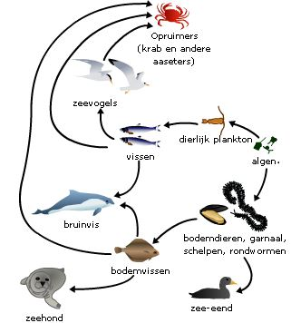
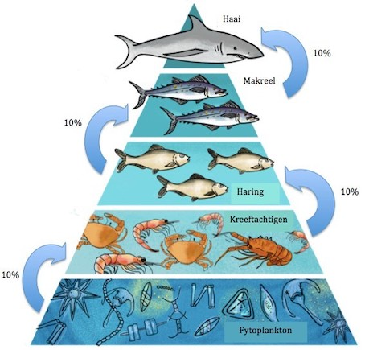

# Zoetwaterbiologie en duiktechniek
Alles wat leeft heeft energie nodig om te groeien en in leven te blijven. De basis van al die energie komt van zonlicht. Planten gebruiken namelijk licht om energie (in de vorm van suikers) te maken uit CO2 (koolstofdioxide) en water, een proces dat fotosynthese wordt genoemd. Hierbij ontstaat ook zuurstof, wat dieren (en ook de planten zelf) nodig hebben om te kunnen leven. In het water leven heel veel kleine plantjes: het plankton. Deze plantjes worden op hun beurt weer gegeten door allerlei dieren, zoals vissen en slakken, die zo aan hun energie komen. En ook deze dieren kunnen weer worden opgegeten door andere dieren. Zo ontstaat uiteindelijk een hele keten: een voedselweb. Het plankton staan onderaan in de keten: zij worden de producenten genoemd. De dieren die het plankton eten, zijn de eerste consumenten. Tweede consumenten eten weer de eerste consumenten, en zo verder. Een compleet voedselweb is vaak erg complex met vele verbindingen tussen verschillende dieren en planten.

*(Een eenvoudig voorbeeld van een voedselweb, in dit geval in de zee)*

Omdat elk dier wat voedsel tot zich neemt, een deel van de energie hieruit gebruikt om van te groeien, is er minder energie beschikbaar voor de volgende consument in het voedselweb. Bij elke stap in de voedselketen blijft er maar ongeveer 10% van de energie over voor de volgende consument. Voor een kilo vis heb je zo al snel 10 kilo, of zelfs 100 kilo plankton nodig. Dit kan je laten zien met een zogeheten voedselpiramide.

De cursisten hebben zelf een voedselweb gemaakt met plaatjes van allerlei dieren en plankton. Ook hebben ze enkele levende waterdieren kunnen bekijken.

Als je een goed beeld wilt krijgen van het leven in het water, kan je gaan duiken. Hiervoor heb je een speciale uitrusting nodig en ook een uitgebreide training. Een paar van de belangrijkste dingen die je nodig hebt zijn een luchtfles en een speciaal vest (een trimvest) waarmee je kunt drijven en zinken. De cursisten hebben zelf kunnen uitproberen hoe je kunt ademen met een luchtfles. Ook werd gedemonstreerd hoe je een trimvest moet gebruiken.
