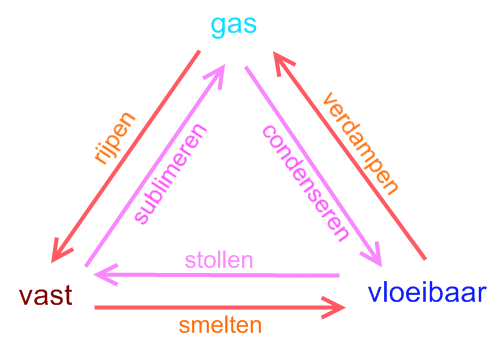
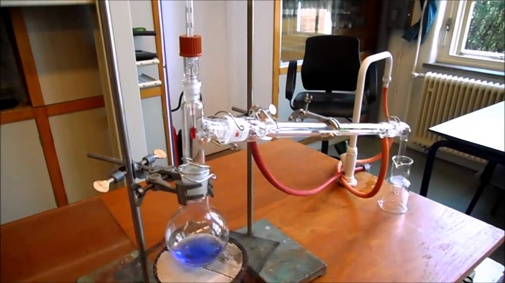
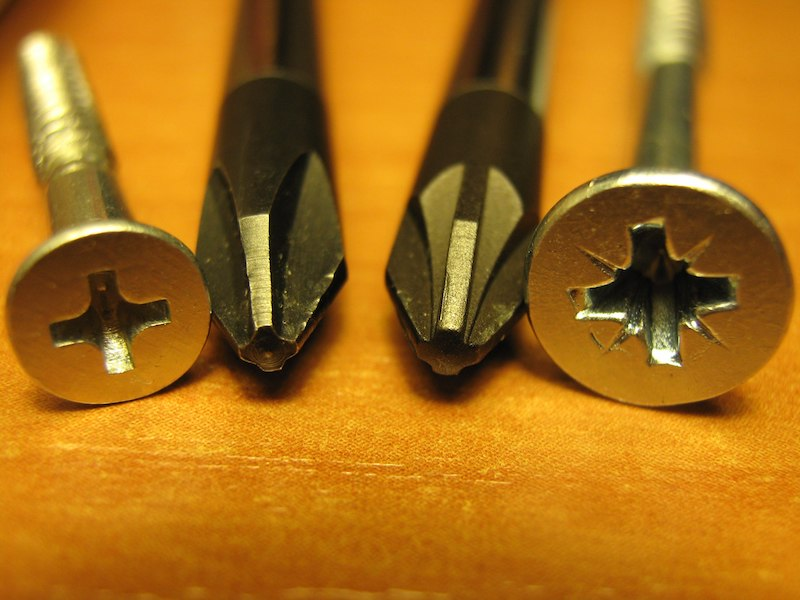

# Destillatie
In dit deel van de les ging het over destillatie, een scheidingstechniek uit de scheikunde. Deze techniek maakt gebruik van de verschillen in kookpunt van verschillende (vloei)stoffen. Water heeft bijvoorbeeld een kookpunt van 100 graden Celcius, terwijl aceton al bij 56 graden kookt. Bij het koken van een vloeistof gaat deze van de vloeibare vorm over in de gasvorm. Dat heet verdampen. Het omgekeerde kan ook: van gas naar vloeistof. Dat heet condenseren. Dat doe je door het gas weer af te koelen. Denk maar aan de ademwolkjes die je uitademt bij koud weer: het gasvormige water wat je uitademt, wordt zichtbaar doordat het sterk afkoelt en weer kleine druppeltjes vormt. Een stof kan ook nog in een vaste vorm bestaan; bij water is dat bijvoorbeeld als ijs. De overgangen tussen al deze verschillende toestanden (fases) heten fase-overgangen. Ze staan hieronder samengevat in een plaatje.

Als je verschillende vloeistoffen die met elkaar zijn vermengd van elkaar wilt scheiden (bijvoorbeeld water en alcohol als je zuivere alcohol wilt krijgen), dan moet je het mengsel eerst aan de kook brengen en dan zorgen dat je de damp (of eigenlijk het gas) opvangt en weer afkoelt. De stof met het laagste kookpunt zal als eerste gaan verdampen, de andere vloeistof blijft achter. In het geval van water en alcohol zal de alcohol dus als eerste gaan verdampen. Wanneer je die alcoholdamp afkoelt en de druppels die daarbij ontdtaan vervolgens opvangt, kun je de zuivere alcohol opvangen en heb je die gescheiden van de rest van de vloeistof. Helemaal zuiver is die alcohol eigenlijk niet, omdat er altijd wel wat water meekomt wat ook verdampt is door de warmte. Door het proces te herhalen kan je de alcohol wel steeds zuiverder krijgen, maar nooit 100%.

Het proces waarbij je op deze manier, dus met verdampen en weer condenseren, (vloei)stoffen van elkaar kunt scheiden heet destillatie. Dit gebeurt met een destillatie-opstelling, waarvan verschillende varianten bestaan. Hieronder staat een voorbeeld. Het belangrijkste onderdeel is de koeler, een dubbele glazen buis waar water doorheen stroomt om de binnenste buis af te koelen.

# Demontage
Het tweede onderdeel van de les ging over demontage. Dat is het uit elkaar halen van bijvoorbeeld een apparaat zonder het kapot te maken. Na demontage kan een apparaat altijd weer in elkaar worden gezet. Bijvoorbeeld na een reparatie. De cursisten hebben zelf verschillende apparaten gedemonteerd en geleerd welke schroevendraaiers je hiervoor moet gebruiken.

De twee belangrijkste soorten schroevendraaiers zijn de phillipsschroevendraaier (PH) (kruiskop) en de pozidrivschroevendraaier (PZ) (kruiskop met extra sterretje). Dit laatste type heeft vier extra ribben en past alleen op schroeven die extra gleuven hebben. De verschillen zijn te zien in de afbeelding hieronder.

