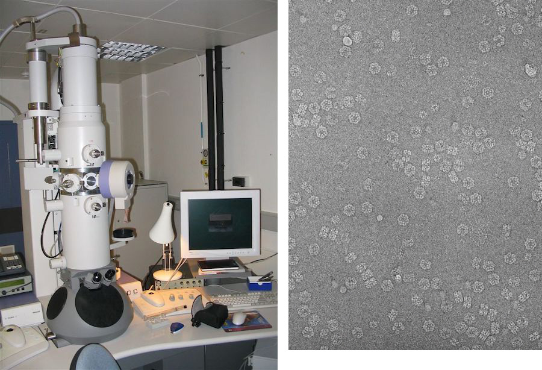

# Elektronenmicroscopie
De cursisten zijn naar een lab met elektronenmicroscopen gegaan, waar ze zelf door de microscopen hebben kunnen kijken. Een elektronenmicroscoop heeft een veel sterkere vergroting dan een lichtmicroscoop, waardoor je veel kleinere dingen kunt zien. Met een lichtmicroscoop kan je hooguit een bacterie zien, maar een elektronenmicroscoop kan zelfs kleine onderdelen van een bacterie of andere cel laten zien, zoals eiwitten. Dit is op de schaal van nanometers, dus een miljardste van een meter. Om zo sterk te kunnen vergroten, moet je elektronen gebruiken in plaats van licht. Dat betekent wel dat je geen kleuren kunt zien en (meestal) ook geen levend materiaal kunt bekijken. Ook zijn elektronenmicroscopen erg groot en duur.

*(Links: een elektronenmicroscoop; Rechts: hemoglobine (bloedeiwit) van een regenworm)*
