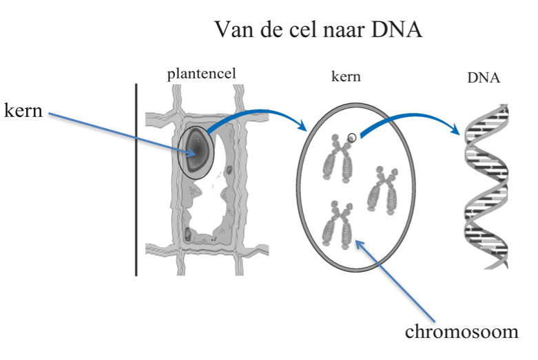

# Eerste uur
In het eerste uur werd uitgelegd wat DNA is en wat je er zoal mee kunt doen. Alle levende wezens (organismen) hebben DNA in hun cellen. DNA is een heel lang molecuul wat bestaat uit een lange reeks van kleinere bouwstenen die samen een code vormen. In deze genetische code staat 'geprogrammeerd' hoe een organisme, van bacterie tot mens, eruit ziet. Het bepaalt bijvoorbeeld je oogkleur, je haarkleur en of je een jongen of meisje bent. Er kunnen echter ook foutjes in het DNA zitten die ervoor zorgen dat je een bepaalde ziekte krijgt (zoals taaislijmziekte).

*Het DNA ligt opgeborgen in de celkern van cellen, en zit verpakt en opgerold in chromosomen*

Het is ook mogelijk om in een laboratorium veranderingen aan te brengen in het DNA van organismen (genetische manipulatie of modificatie). Op die manier kan je een bacterie, plant of zelfs dier andere eigenschappen geven. Bacteriën kun je vrij gemakkelijk genetisch manipuleren waardoor je ze bijvoorbeeld medicijnen of andere nuttige stoffen kunt laten produceren. Planten en dieren zijn moeilijker genetisch aan te passen, maar sinds de ontdekking van een nieuwe techniek nog niet zo lang geleden wordt dit steeds eenvoudiger. In de toekomst zal het zelfs mogelijk zijn om mensen zo aan te passen dat je van tevoren de eigenschappen van een kind kunt bepalen. Dit worden 'designer-baby's' genoemd. Hoewel het technisch mogelijk zal worden, is het de vraag of je het ook zou moeten toestaan. Hierover zal in de komende jaren nog volop gediscussieerd gaan worden.

De cursisten hebben ook nog hun eigen DNA uit hun spuug gehaald en in een buisje gestopt, wat ze mee konden nemen.

# Tweede uur
In dit uur hebben de cursisten ontdekt wat de begrippen 'hydrofiel' en 'hydrofoob' betekenen. Als een stof hydrofiel is, zoals alcohol of suiker, dan mengt het goed met water of lost het er goed in op. Als een stof hydrofoob is, zoals olie of benzine, dan mengt het slecht met water of lost het er slecht in op. Dit kan je bijvoorbeeld laten zien met knettersuiker. Dit zijn suikerkorrels waarin hele kleine belletjes met koolzuurgas zitten opgesloten. Zodra deze suikerkorrels oplossen, ontsnapt het koolzuur en hoor je geknetter. Dit lukt prima met water of speeksel in je mond, maar zodra je de korrels in olie legt (een hydrofobe stof waarin suiker niet oplost), gebeurt er niks.

Hierna hebben de cursisten nog een experiment gedaan met de wateropnemende korreltjes uit luiers. Eerst hebben ze de luiers opengeknipt, waarna ze de korreltjes in een bakje hebben gedaan en er water bij hebben gegoten. De korreltjes bleken erg veel water op te nemen (te absorberen), waarbij er een soort gel werd gevormd die het water vasthield zodat het niet meer vloeibaar was. Op die manier zorgen luiers er dus voor dat een baby droog blijft. Door zout toe te voegen kan je de gel weer vloeibaar maken.
