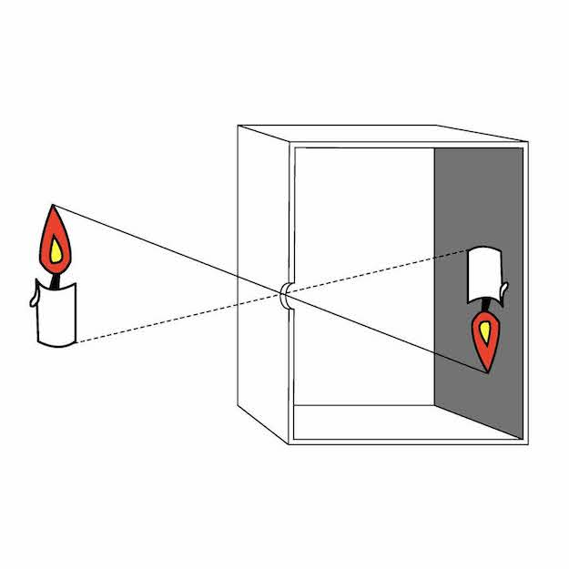

# Dichtheid
De cursisten hebben van verschillende stukjes hout die van hetzelfde materiaal waren, maar niet even groot, de inhoud (het volume) gemeten en berekend en daarna het gewicht bepaald. Met die gegevens konden ze uitrekenen wat de dichtheid van het materiaal was. De dichtheid van een materiaal/voorwerp is het gewicht gedeeld door het volume. Een hogere dichtheid betekent dat het materiaal zwaarder is en je er dus minder van nodig hebt om hetzelfde gewicht te bereiken (denk maar aan een kilo lood en een kilo veren). Elk materiaal heeft zijn eigen dichtheid, dus ook lucht. De dichtheid van lucht is moeilijker te bepalen. Maar door een hele gevoelige weegschaal te gebruiken en een injectiespuit met een bepaald volume, is dit toch gelukt. Deze zelf bepaalde dichtheid van de lucht kwam goed overeen met de werkelijke dichtheid.

Koolstofdioxide (CO2) heeft een hogere dichtheid dan lucht (het is dus zwaarder). Je kunt er daarom een kaars mee blussen door het gas eroverheen te 'gieten'. Naast dit experiment zijn er nog enkele andere experimenten gedaan met droogijs (bevroren CO2).

# Camera obscura
In het tweede uur hebben de cursisten zelf een camera obscura gemaakt van een blikje of een half melkpak. Een camera obscura is een hele primitieve (eenvoudige) camera die werkt met alleen een klein, rond gat en (in dit geval) een vel doorschijnend vloeipapier. Er zit dus geen lens in. Het licht valt door het gat en het voorwerp waar het gat naartoe is gericht, wordt geprojecteerd op het stuk vloeipapier. Het beeld wordt verkleind en staat op zijn kop. Eigenlijk net als bij een lens.

*(De werking van een camera obscura)*
