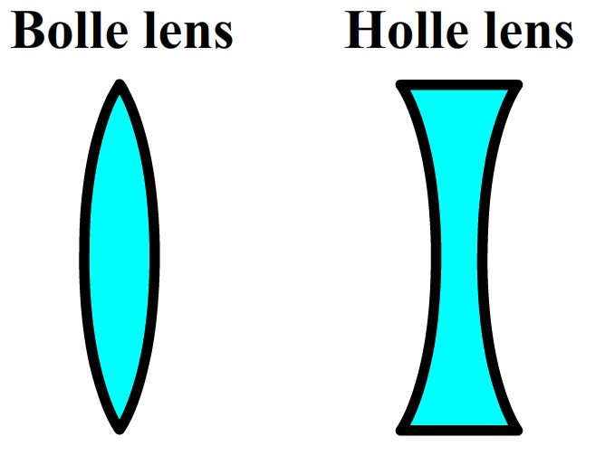
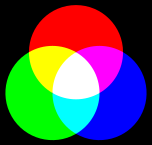

# Licht en kleur
De zon, een lamp of een anddere lichtbron stralen licht uit. De lichtstralen zelf kun je niet zien. Je kunt alleen licht zien wat in je ogen valt. We zien de dingen om ons heen omdat ze het licht weerkaatsen (reflecteren). Lichtstralen kunnen ook van richting veranderen. Een lichtstraal die door bijvoorbeeld een lens of een prisma gaat, wordt hierdoor afgebogen in een andere richting (dat heet lichtbreking). Een holle lens (zie afbeelding) breekt het licht op zo'n manier dat als je er doorheen kijkt, alles kleiner lijkt. Een bolle lens is juist een vergrootglas als je er van dichtbij doorheen kijkt. Maar als je er met gestrekte arm doorheen kijkt, staat alles op z'n kop. Lenzen zitten onder andere in (foto)camera's en ook in je oog.

Als je gekleurd licht mengt, kun je nieuwe kleuren maken. Uit rood en groen licht onstaat geel, uit rood en blauw ontstaat magenta (een soort paars), en uit groen en blauw ontstaat cyaan ('groenblauw'). Als je alle kleuren licht mengt, krijg je wit. Wit licht is dus een soort mengsel van alle kleuren door elkaar. Dat kan je zien door een regenboog te maken. Een regenboog ontstaat wanneer wit licht door bijvoorbeeld een prisma of een waterdruppel (zoals bij een regenbui) wordt gebroken in alle kleuren waaruit het witte licht bestaat.

