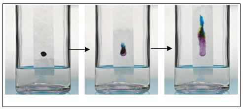

# Scheidingstechnieken

Een belangrijk onderdeel van de scheikunde is het scheiden van stoffen. Hiervoor bestaan verschillende scheidingstechnieken, zoals centrifugeren, filtreren en ook chromatografie. Bij elke techniek wordt gebruik gemaakt van de verschillende eigenschappen van de te scheiden stoffen, zoals het gewicht of hoe sterk ze binden aan het materiaal (zoals papier) waarmee je de stoffen wilt scheiden. De bekendste en eenvoudigste vorm van chromatografie is het scheiden van kleurstoffen met papierchromatografie: op een stukje filtreerpapier zet je een stip met bijvoorbeeld een stift, waarna je het strookje papier met de onderkant in een laagje water (of alcohol) hangt zodat de vloeistof naar boven toe 'loopt'. Daarbij lossen de kleurstoffen op in de vloeistof en worden zo mee naar boven toe getrokken. Als de kleurstof uit een mengsel van andere kleurstoffen bestaat (zoals bij bruin), dan zullen deze verschillende kleurstoffen van elkaar worden gescheiden doordat ze niet allemaal even goed oplossen.

Tijdens deze les hebben de cursisten verschillende kleurstoffen (stiften, printerinkt, bladgroen) van elkaar gescheiden met papierchromatografie, maar ook met kolomchromatografie. Bij dit laatste werden de kleurstoffen op een kolommetje (een soort buisje met daarin een materiaal waaraan de kleurstoffen binden) gebracht en met een alcoholoplossing van verschillende percentages weer van de kolom af gespoeld. Hierbij werden de kleurstoffen in buisjes opgevangen, waardoor je buisjes met verschillende kleurstoffen kreeg.

Tot slot werd nog gedemonstreerd dat je (karne)melk met een zeer snelle centrifuge kunt scheiden in een kleurloos, waterig deel en een dikkig, wit deel wat grotendeels bestaat uit eiwitten en vet.
