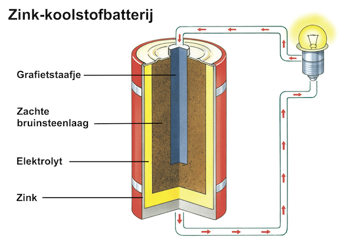
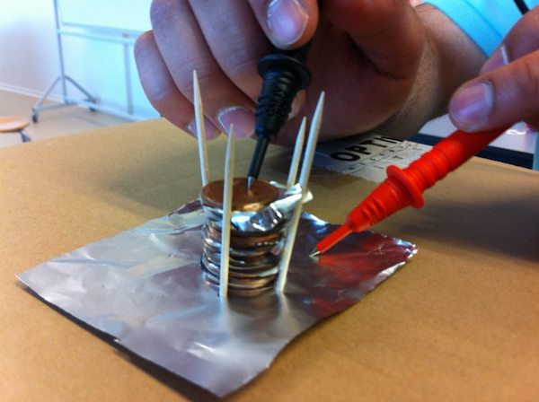
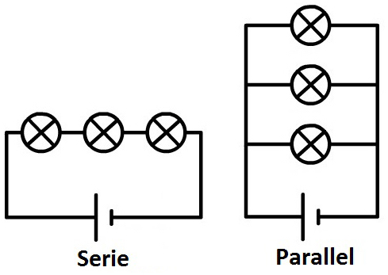

# Elektrochemie
Elektrochemie gaat over elektriciteit en chemie (scheikunde). Aan de ene kant kunnen chemische reacties elektriciteit opwekken, zoals in een batterij gebeurt. Maar aan de andere kant kan je met elektriciteit ook chemische reacties laten plaatsvinden. Als je bijvoorbeeld stroom door water met een beetje zout laat gaan, maak je daarmee de watermoleculen kapot. Hierdoor ontstaat waterstof- en zuurstofgas. Als je deze gassen opvangt en weer met elkaar laat reageren tot water (zoals in een brandstofcel, een speciaal soort batterij die gevuld wordt met een brandstof), dan ontstaat daarbij weer elektriciteit.

Er bestaan verschillende soorten batterijen, maar de meest gebruikte soort in het dagelijks leven is de zink-koolstofbatterij. Hierin zit een grafietstaafje (een soort potlood), met daaromheen een laag van bruinsteen. De buitenkant van de batterij is van zink, en dat reageert met het bruinsteen waarbij elektriciteit ontstaat. Zo'n enkele batterij (die ook wel een cel wordt genoemd) geeft een spanning van 1,5 volt. Sommige batterijen bestaan uit meedere cellen van 1,5 volt, waardoor je bijvoorbeeld een batterij van 4,5 of van 9 volt krijgt.

*(Het binnenste van een zink-koolstofbatterij)*

De cursisten hebben zelf een batterij gemaakt van koper, zink en daartussen een nat laagje met een zuur. Dit kan bijvoorbeeld door koperen muntjes en zinken schijfjes te gebruiken en deze te stapelen (een zogeheten zuil van Volta), of door een stukje koper en een verzinkte spijker in een aardappel of citroen te steken. De chemische reactie tussen het zink en het zuur geeft dan de elektriciteit.

*(Voorbeeld van een zuil van Volta, een eenvoudige zelfgemaakte batterij. Hier is in plaats van zink, aluminiumfolie gebruikt.)*

# Elektrische schakelingen
De cursisten hebben met kerstlampjes verschillende schakelingen gemaakt. Zo hebben ze meerdere lampjes op een enkele batterij aangesloten of juist op meer betterijen om zo te zien wat er gebeurt met de felheid van het licht. Ze hebben o.a. ontdekt dat door de lampjes achter elkaar te plaatsen, oftewel in serie te schakelen, ze minder fel gaan branden. Maar door ze parallel te schakelen (zie schema), blijven ze allemaal even fel branden.

*(Verschil tussen een serie- en een parallelschakeling. De rondjes zijn lampjes, de streepjes de batterij.)*
