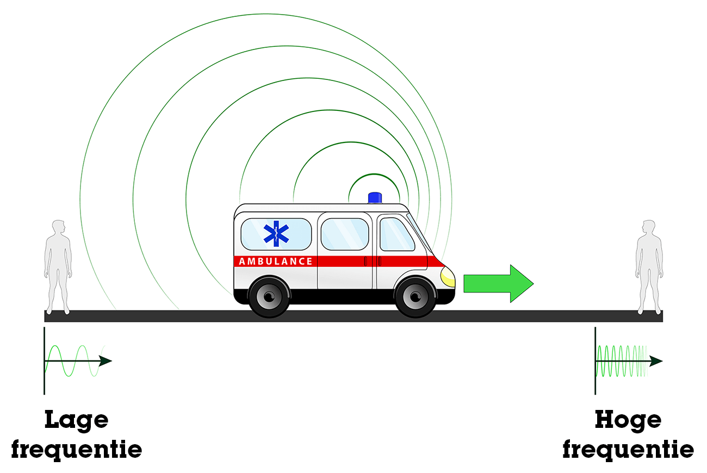

# Het dopplereffect en radiosterrenkunde
Geluid bestaat uit golven, ofwel trillingen in de lucht. Hoe meer trillingen per seconde, hoe hoger de toon. Veel trillingen per seconde betekent dat de golven korter worden: ze zitten als het ware dichter op elkaar. Je kunt dit laten zien door het geluid te meten en de geluidsgolven zichtbaar te maken in een soort grafiek. Wanneer nu een geluidsbron, zoals een toeterende auto of ambulance met sirenes, naar je toe beweegt dan hoor je de toon hoger dan wanneer de geluidsbron stil staat. Als de geluidsbron van je af beweegt dan hoor je juist een lagere toon. Dit komt doordat de geluidsgolven ofwel in elkaar worden gedrukt (als de geluidsbron naar je toe komt), ofwel uit elkaar worden getrokken (als de geluidsbron van je af beweegt). Het wordt het dopplereffect genoemd. Je kunt dit bijvoorbeeld demonstreren door een bal die een eentonig geluid produceert rond te laten draaien aan een touwtje, waarbij je hoort dat de toon een klein beetje op en neer gaat. Ook kun je er snelheid mee meten, wat de cursisten zelf hebben geprobeerd door hard op en neer te rennen terwijl ze een piepende geluidsbron in hun hand hadden.

Het dopplereffect wordt ook gebruikt in de (radio)sterrenkunde. Er bestaan verschillende soorten telescopen om naar het heelal te kijken. Naast zichtbaar licht, kan je ook 'kijken' met radiogolven. Onze ogen zien deze straling niet, maar de objecten in het heelal zenden het wel uit. Net als met een gewone radio, kan je zulke radiogolven uit de ruimte opvangen met antennes. Dit zijn vaak antennes in de vorm van een grote schotel, zodat je ze specifiek kunt richten op een stukje van het heelal. Zulke radiotelescopen staan onder andere bij Astron in Dwingeloo. De opgevangen radiostraling kun je vervolgens omzetten in zichtbare afbeeldingen. Maar je kunt er ook metingen mee doen aan bijvoorbeeld de snelheid van materie (zoals waterstofatomen) in het heelal, want ook bij radiostraling treedt het dopplereffect op. Op die manier kan je bijvoorbeeld te weten komen hoe ons Melkwegstelsel eruit ziet (we kunnen hier immers geen foto's van maken omdat we er zelf in zitten).

*(Illustratie van het dopplereffect bij een rijdende ambulance)*
