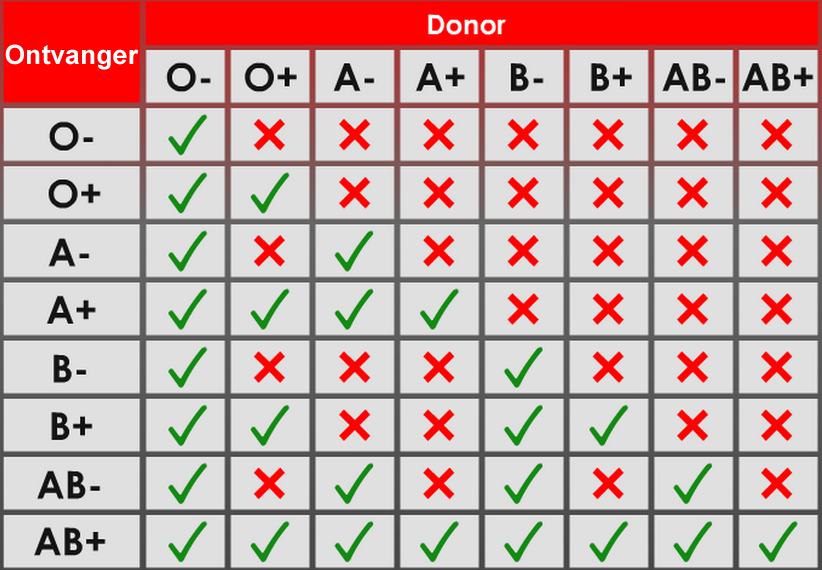

# Bloed en bloedonderzoek
Vroeger mislukten bloedtransfusies meestal omdat nog niet bekend was dat er verschillende bloedgroepen bestaan, en doordat men nog niet wist hoe je bloed kon bewaren zonder dat het ging stollen (hard worden). Bij een bloedtransfusie wordt er bloed van de ene persoon (de donor) ingebracht bij een andere persoon (de ontvanger), bijvoorbeeld als iemand na een ongeluk veel bloed heeft verloren. Het is dan erg belangrijk dat iemand bloed krijgt met de juiste bloedgroep, omdat het lichaam anders het vreemde bloed gaat 'aanvallen'. Daarbij binden antilichamen van de ontvanger zich aan de rode bloedcellen van de donor, waardoor deze gaan samenklonteren in het lichaam.

Bloed bestaat uit vloeistof (bloedplasma) met daarin rode en witte bloedcellen. De rode bloedcellen zorgen voor het transport van zuurstof door het lichaam, en de witte bloedcellen zorgen voor de afweer tegen ziekteverwekkers (zoals bacteriën en virussen). Bij een bloedtransfusie worden alleen de rode bloedcellen van een donor aan een ontvanger gegeven. Daarvoor moet het bloed eerst in een centrifuge worden gedaan om de rode en witte bloedcellen van elkaar te scheiden.

Aan de buitenkant van de rode bloedcellen zitten allerlei stofjes (antigenen) die bij mensen (en dieren) onderling kunnen verschillen. Deze verschillen bepalen iemands bloedgroep. Het belangrijkste bloedgroepensysteem is het ABO- en het resussysteem. In dit systeem bestaan er 8 verschillende bloedgroepen: A+, A-, B+, B-, AB+, AB-, O+ en O-. De '+' en de '-' geven aan of de resusfactor wel of niet aanwezig is. In de onderstaande tabel is te zien welke bloedgroepen iemand met een bepaalde bloedgroep kan ontvangen, of aan wie iemand bloed kan doneren (iemand met bloedgroep O- kan bijvoorbeeld aan iedereen bloed doneren, terwijl iemand met bloedgroep AB+ alleen kan doneren aan iemand anders met AB+).

Tijdens de les werd van enkele personen de bloedgroep bepaald met een speciale testkaart. Ook werden preparaten met bloed bekeken onder de microscoop en werd varkensbloed gecentrifugeerd om bloedcellen en plasma van elkaar te scheiden.

#Alternatief programma
De cursisten die niet mee wilden doen met de les over bloed zijn aan de slag gegaan met het verbeteren van hun eerder gemaakte camera obscura. Zo hebben ze er onder andere een lens in gezet om een beter beeld te krijgen.
