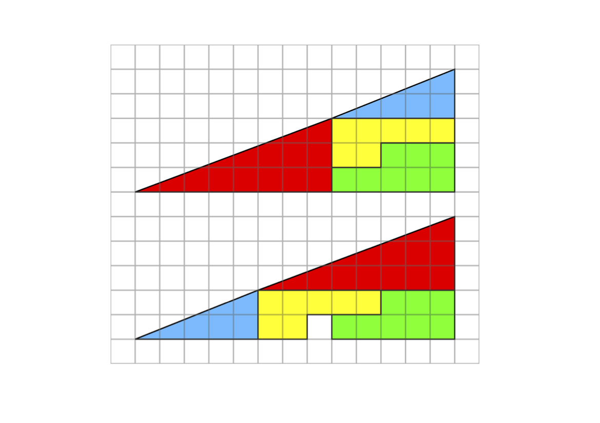
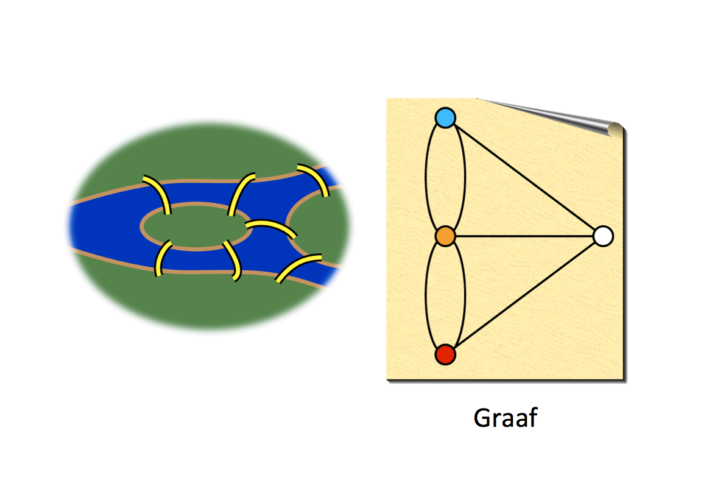

# Eerste uur
Tijdens deze les leerden de cursisten dat het bij wiskunde zeker niet alleen maar om rekenen en formules draait. Met alleen afbeeldingen kun je - zonder te rekenen - toch aan wiskunde doen, door logisch na te denken en verder te kijken dan je neus lang is. Zo moesten de cursisten ontdekken hoe het komt dat in de onderstaande afbeelding er ineens een vakje overblijft, wat uit het niets lijkt te komen.

De oplossing zit hem in het feit dat de grote driekhoek, die bestaat uit de andere gekleurde figuren, eigenlijk geen driekhoek is. Als je er een liniaal langs legt, zie je dat er een knik in de schuine zijde zit op de plek waar de kleine gekleurde driehoeken elkaar raken. Het is dus eigenlijk een vorm van gezichtsbedrog.

Ook moesten de cursisten nog het raadsel van de 7 bruggen van Koningsbergen oplossen, waarbij het de vraag was of het mogelijk is om alle 7 bruggen tijdens een wandeling slechts één keer over te steken. Door een schematische afbeelding te maken van de situatie, een zogeheten graaf, wordt het iets makkelijker om te bepalen of dit mogelijk is. Maar het kostte de beroemde wiskundige Leonhard Euler destijds al de nodige moeite om hier een wiskundig bewijs voor te vinden.

Tot slot hebben ze ook nog een Möbiusband gemaakt van een strook papier.

# Tweede uur
Tijdens het tweede uur hebben de cursisten kennisgemaakt met (elektro)magnetisme. Eerst konden ze met behulp van enkele permanente magneten en wat ijzervijlsel de magnetische veldlijnen zichtbaar maken. Daarna hebben ze zelf een elektromagneet gemaakt van een grote spijker en een lange, dunne elektriciteitsdraad die heel vaak om de spijker werd gewikkeld. Wanneer ze nu stroom door de draad lieten lopen, werd de spijker magnetisch. Zodra de stroom weer werd onderbroken was het magnetisme weg. Elektromagneten worden in allerlei apparaten gebruikt en kunnen soms erg sterk zijn (bijvoorbeeld in kranen die autowrakken optillen).
