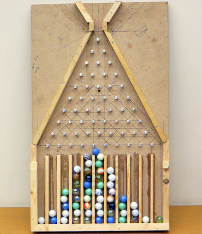

# Statistiek (toeval en kansen)

Iedereen heeft te maken met toeval. Of je nou aan een loterij meedoet en hoopt te winnen, of op je fiets met je telefoon speelt en gelukkig net geen ongeluk krijgt. Of iets wel of niet gebeurt, valt niet altijd met zekerheid te voorspellen. Soms is er een kleine kans dat iets gebeurt, maar soms een grote. Bij een grote kans zal iets vaker gebeuren dan bij een kleine kans. Maar het kán gebeuren, hoe klein de kans ook is. Je kunt van tevoren berekenen hoe groot de kans precies is dat iets gebeurt. Bijvoorbeeld: als je met een dobbelsteen gooit, weet je van tevoren dat de kans dat je een 1 gooit even groot is als de kans dat je een 2, 3, 4, 5 of 6 gooit. Namelijk 1 op 6 (oftewel 1/6e). Met twee dobbelstenen gooien maakt het al wat ingewikkelder. Je hebt dan bijvoorbeeld meer kans om in totaal 7 te gooien dan 2 of 12, omdat er meer manieren zijn om in totaal op 7 uit te komen dan op 2 of 12. Toch zal je niet elke keer dat je met twee dobbelstenen gooit, 7 gooien. Soms gebeurt het zelfs dat je vaker een heel laag of heel hoog aantal ogen gooit dan dat je 7 gooit. Dat komt allemaal door toeval.

Met een zogeheten Galtonbord kan je een balletje, zoals een knikker, langs een heleboel pinnen (bijvoorbeeld spijkers) naar beneden laten rollen. Zie het plaatje hieronder. Door de botsingen met die pinnen moet het balletje steeds 'kiezen' om de ene of de andere kant op te rollen. Uiteindelijk komt het balletje terecht in een van de vakjes onderaan het bord. Je kunt door heel vaak een balletje te laten rollen bepalen waar de kans het grootst is voor het balletje om terecht te komen. Maar je kunt dit ook uitrekenen (met de zogeheten driehoek van Pascal). Het blijkt dat de kans het grootst is om ergens in het midden terecht te komen. Als je maar vaak genoeg een balletje laat rollen, krijg je uiteindelijk een mooie klokvormige verdeling van balletjes over de vakjes. De cursisten hebben dit zelf uitgeprobeerd met een eenvoudig Galtonbord van spijkers.

*Een Galtonbord met knikkers en spijkers. Te zien is dat je een mooie klokvormige verdeling over de vakjes onderaan krijgt.*

Tot slot werd er nog een beroemd televisiespel nagespeeld waarbij je drie gesloten deuren hebt en er achter een van de deuren een mooie prijs staat. De kandidaat mag raden achter welke deur die prijs staat. Als de goede deur geraden wordt, wint de kandidaat de prijs. Nadat hij of zij een deur gekozen heeft, krijgt de kandidaat te horen achter welke deur de prijs in elk geval niet staat. Er blijven dan dus nog twee deuren over om uit te kiezen. De kandidaat mag nu nog een keer van keuze veranderen. Is het dan verstandiger om je keuze te veranderen, of om juist bij je eerste keuze te blijven? Het blijkt dat je meer kans hebt om de prijs te winnen als je van keuze verandert. Maar dat wil natuurlijk niet zeggen dat je door je keuze te veranderen altijd die prijs wint. Dat blijft tenslotte toeval.
