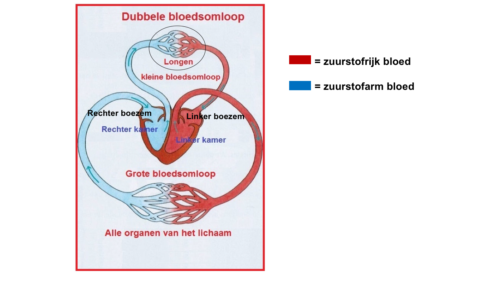

# Eerste uur
In dit eerste uur hebben de cursisten zelfstandig een zogeheten protocol gevolgd, een soort recept voor een wetenschappelijk experiment. In dit geval was het doel van het experiment om DNA uit aardbeien te halen (DNA-extractie). Doordat ze met opzet weinig of geen hulp kregen van de begeleiders, konden ze allerlei fouten maken waar ze van konden leren. Het was dus belangrijk om het protocol goed te lezen. Uiteindelijk is het de meeste cursisten gelukt om zelfstandig DNA in een buisje te krijgen.

# Tweede uur
Het tweede uur ging over het hart en de bloedsomloop. Er werd eerst wat uitleg gegeven over de werking van het hart en wat de grote de kleine bloedsomloop zijn. Het hart is eigenlijk een pomp die het bloed door het lichaam pompt, zodat de zuurstof die door het bloed wordt opgenomen in de longen zich door het hele lichaam kan verspreiden. De kleine bloedsomloop gaat van het hart naar de longen en weer terug, de grote bloedsomloop gaat vervolgens van het hart naar de rest van het lichaam en weer terug.

*(De grote en de kleine bloedsomloop)*

Vervolgens gingen de cursisten hun eigen hartslag en bloeddruk meten. De hartslag is hoe snel het hart klopt (aantal slagen per minuut), de bloeddruk is hoe groot de druk is in de (slag)aderen. Bij inspanning heeft het lichaam meer zuurstof nodig en dus zal het hart sneller gaan kloppen om meer bloed te kunnen rondpompen. Ook zal de bloeddruk stijgen, omdat het hart dan harder (krachtiger) moet pompen. Bij alle cursisten die hun hartslag en bloeddruk zowel voor als na inspanning hebben gemeten, bleek dit inderdaad te kloppen.
