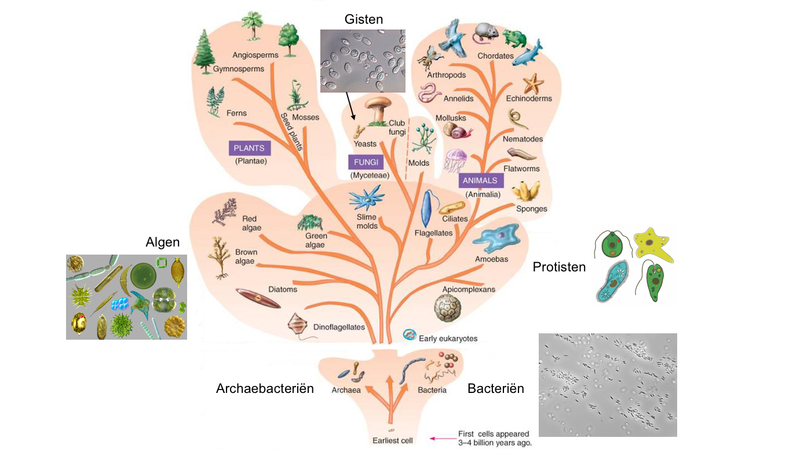

# Eerste uur
De eerste les ging over micro-organismen, ofwel levende wezens die alleen zichtbaar zijn met een microscoop. Micro-organismen zijn meestal eencellig, maar kunnen soms ook meercellig zijn. Bijna alle micro-organismen zijn bacteriën, archaebacteriën ('oerbacteriën'), algen, protisten of schimmels.
- Bacteriën en archaebacteriën zijn de oudste vormen van leven. Ze lijken in uiterlijk sterk op elkaar, maar het zijn echt twee hele verschillende groepen. Al het andere leven heeft zich uiteindelijk gevormd uit een soort voorloper van deze bacterie-achtigen. Bacteriën (en archaea) komen letterlijk overal voor, van hoog in de lucht tot diep in de aarde. Ook in de meest extreme omstandigheden (zoals op hele hete of juist extreem koude plekken). En in en op ons lichaam. Daar hebben bacteriën allerlei nuttige functies, zoals het helpen bij de afweer tegen schadelijke bacteriën of het helpen verteren van ons voedsel (in de darmen). Ze zijn van alle micro-organismen het kleinst: ongeveer een micrometer (1/1000e meter).
- Algen lijken een beetje op planten omdat ze zelf hun voedsel maken uit licht, maar de meeste algen behoren niet tot de echte planten. Eencellige algen vallen onder de micro-organismen. Je vindt ze meestal in het water (zowel zoetwater als zoutwater).
- Protisten lijken op kleine diertjes, maar behoren niet echt tot de dieren. Ze kunnen vaak zwemmen en sommige kunnen van vorm veranderen. De bekendste zijn de amoebes (spreek uit: 'ameubes') en het pantoffeldiertje.
- Schimmels kunnen eencellig of meercellig zijn. De eencellige schimmels, ofwel de gisten, behoren tot de micro-organismen.

Bacteriën en gisten kunnen soms schadelijk zijn, maar ze kunnen voor ons ook erg nuttig zijn. We kunnen ze namelijk gebruiken voor het maken van bepaalde voedselproducten. Zo worden yoghurt en zuurkool gemaakt met melkzuurbacteriën, die suikers omzetten in melkzuur waardoor je een zure smaak krijgt. En gist wordt gebruikt om alcohol te maken uit suikers, zoals bij wijn en bier. Ook brood wordt gemaakt met gist omdat het het deeg laat rijzen (doordat er koolzuurgas wordt gevormd).

De cursisten hebben zelf een kweekje gemaakt van de bacteriën van hun vingers: eerst zonder wassen, daarna na wassen met alleen water, na wassen met zeep en ten slotte na het dopen van hun vinger in alcohol (wat bacteriën doodt). Na een week kunnen ze het resultaat bekijken.

*De stamboom van het leven op aarde. Micro-organismen komen voor onder de bacteriën, archaebacteriën, algen, protisten en schimmels.*

# Tweede uur
De tweede les werd gedeeltelijk samen met de Arduino-cursisten gegeven, omdat de informatie ook voor hen nuttig was. Het ging hierbij over het verschil tussen stroom en spanning en over hoe spanning verdeeld wordt over een serie lampjes of weerstanden.
- Spanning is de energie die in elektriciteit aanwezig is: deze kan verbruikt worden om bijvoorbeeld een lampje te laten branden of een motortje te laten draaien. Je kunt het vergelijken met het lopen over een vlakke weg of juist een steile berg op: op een vlakke weg verbruik je weinig energie (zoals in een stroomdraad die goed elektriciteit geleidt), en op een berghelling gebruik je veel energie (zoals wanneer je een lampje laat branden). De cursisten hebben dit eerst zelf nagespeeld in een soort spel waarbij ze zelf de 'stroomdeeltjes' waren en heen en weer liepen over het plein tussen verschillende 'apparaten' in een stroomkring. Ze merkten daarbij wat veel en wat weinig energie kost.
- Stroom is het bewegen van de 'stroomdeeltjes' door een draad. Om een stroom te laten lopen, moet je een gesloten stroomkring hebben.

Spanning staat, stroom loopt. Een batterij heeft een bepaalde spanning, bijvoorbeeld 1,5 volt, maar er gaat pas stroom lopen als je de plus en de min met elkaar verbindt.

Als je meerdere lampjes of weerstanden in een stroomkring hebt, gebruikt elk lampje of weerstandje een bepaalde hoeveelheid energie (spanning). Dus als je de spanning meet op verschillende punten in een stroomkring, zal deze steeds lager worden na elk lampje of weerstandje. Tot je bij nul uitkomt na het laatste lampje of weerstandje. Bij twee lampjes/weerstandjes deel je per lampje/weerstandje de totale spanning door twee, bij drie lampjes/weerstandjes door drie, enzovoorts (als alle lampjes of weerstandjes tenminste gelijk zijn).
