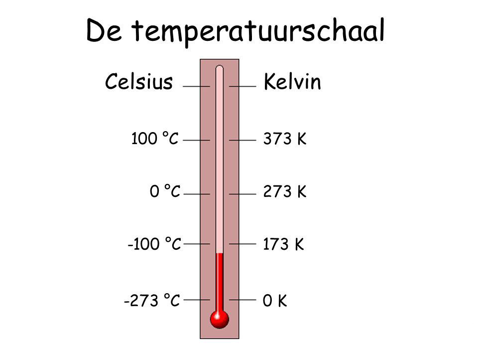
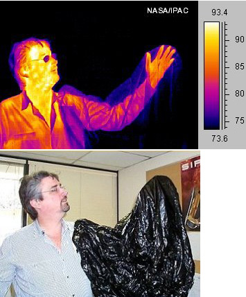

# Warm en koud (Temperatuur)
Als je de temperatuur van iets meet, dan meet je hoe warm of koud het is. Dat doe je met een thermometer. In het dagelijks leven, bijvoorbeeld als het over het weer gaat, meet je meestal de temperatuur in graden Celsius. Dit is een temperatuurschaal die is bedacht door Anders Celsius, waarbij hij voor het vriespunt van water 0 graden koos en voor het kookpunt van water 100 graden. Er bestaan ook andere temperatuurschalen, namelijk Fahrenheit (gebruikt in Amerika) en de Kelvinschaal. De temperatuur van een stof of voorwerp wordt bepaald door de bewegingen van de moleculen of atomen in de stof: hoe harder die bewegen, hoe hoger de temperatuur. Als alle moleculen en atomen stil staan, is de allerlaagste temperatuur bereikt die mogelijk is: het absolute nulpunt. Dit is 0 op de Kelvinschaal, wat overeenkomt met -273,15 graden Celsius.

Als moleculen hard genoeg bewegen, kan een vaste stof vloeibaar worden, en een vloeistof gas worden. Denk maar aan water: als het vriest dan is het ijs en dus vast (hard), gaat het dooien dan wordt het weer vloeibaar, en als het gaat koken dan wordt het gas. Dat komt doordat bij een hogere temperatuur de moleculen door hun snellere bewegingen meer ruimte innemen, waardoor ze makkelijker los van elkaar komen. Hierdoor zetten de meeste materialen ook uit als ze warmer worden, of krimpen ze juist als ze kouder worden.

Alle materialen stralen ook warmtestraling uit. Dat is meestal onzichtbare infraroodstraling, maar als de temperatuur hoog genoeg wordt dan gaat het materiaal ook zichtbaar licht uitstralen. Denk maar aan een metalen staaf die je lang in het vuur houdt: die wordt eerst roodgloeiend en uiteindelijk witheet (hetzelfde zie je ook in een gloeilamp). Infraroodstraling is voor ons onzichtbaar, maar sommige dieren, zoals slangen, kunnen het wel waarnemen. Ook kunnen wij het zichtbaar maken met een warmtebeeldcamera. Daarmee kun je zien hoe warm iets is, wat bijvoorbeeld handig is om te bekijken of ergens een warmtelek zit (zoals in een slecht geïsoleerd huis).

*(Hetzelfde plaatje in infrarood (boven) en zichtbaar licht (onder). Wat opvalt is dat infraroodstraling wel door dun plastic gaat, maar niet door de glazen bril.)*

De cursisten hebben diverse experimenten gedaan met warm en koud. Zo hebben ze bijvoorbeeld met bepaalde chemische reacties de temperatuur in een bekerglas zo koud gemaakt dat het onder het vriespunt kwam en zelfs vastvroor op een nat blokje hout. Ook hebben ze met vloeibare stikstof geëxperimenteerd (met een temperatuur van -196 graden Celsius) en onder andere ontdekt dat rubber (elastiekjes) bij die lage temperatuur keihard wordt en makkelijk breekt. Verder hebben ze met een warmtebeeldcamera naar de mensen en voorwerpen om zich heen gekeken om te zien hoe warm alles was.
