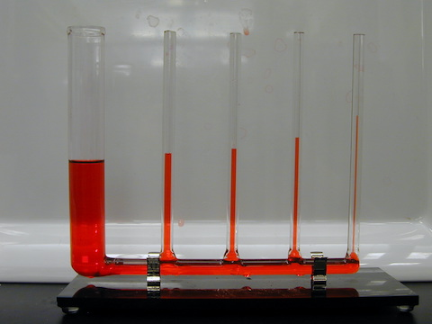

# Moleculaire aantrekkingskrachten
Moleculen zijn de kleinste bouwsteentjes waaruit de materie om ons heen bestaat. Wanneer je een molecuul nog verder opsplitst, dan verdwijnen de eigenschappen van de stof en hou je alleen losse atomen over. Alle moleculen trekken elkaar aan, soms wat meer en soms wat minder. Hiervoor maken ze gebruik van verschillende soorten krachten, zoals waterstofbruggen en vanderwaalskrachten. Het lijkt een klein beetje op de manier waarop magneten elkaar kunnen aantrekken, maar dan door een verschil in lading (plus of min). Hoe sterker de kracht waarmee de moleculen van een stof elkaar aantrekken, hoe meer ze naar elkaar toe worden getrokken. Als deze kracht relatief klein is, dan bewegen de moleculen kriskras door elkaar heen en is de stof bij kamertemperatuur gasvormig. Als de kracht groter is, dan is een stof juist vloeibaar of zelfs vast (weinig beweging van de moleculen). Wanneer moleculen van dezelfde stof, zoals water, elkaar aantrekken dan noem je dat cohesie. Als moleculen van verschillende stoffen elkaar aantrekken, zoals bij water en glas, dan heet dit adhesie (denk aan verf die op de muur blijft kleven of het vastlijmen van verschillende materialen). Vloeistoffen worden ook aangetrokken tot het materiaal waar ze in zitten, zoals glas of plastic. Dit zorgt er bijvoorbeeld voor dat in een smal buisje de vloeistof omhoog wordt getrokken tot een hoger niveau dan in een brede buis. Dit wordt capillaire werking genoemd, en het is een belangrijk mechanisme voor planten en bomen om water door de kleine kanaaltjes (houtvaten) in hun stengel of stam omhoog te transporteren. De aantrekkingskrachten tussen moleculen zorgen ook voor een zogeheten oppervlaktespanning, wat wil zeggen dat er op het grensvlak tussen de vloeistof en de lucht een soort 'vliesje' wordt gevormd waarop bijvoorbeeld iets kan blijven drijven dat eigenlijk zwaarder is dan de vloeistof, zoals een paperclip op water. Sommige insecten maken hier ook gebruik van, waardoor ze over het water kunnen lopen. Wanneer een stof goed oplost in water, dus sterk door de watermoleculen wordt aangetrokken, dan wordt die stof hydrofiel ('waterminnend') genoemd. Andersom, dus als een stof juist slecht oplost in water, dan heet dat hydrofoob (waterafstotend). Dat laatste zie je bijvoorbeeld bij olie en water, die niet met elkaar willen mengen.

*(Voorbeeld van capillaire werking: het water staat hoger in de dunste buisjes)*

Er zijn diverse experimenten gedaan om de aantrekkingskrachten tussen moleculen te demonstreren. Bijvoorbeeld door te laten zien dat water en wasbenzine (een hydrofobe stof) niet mengen, en ook op een verschillende manier worden aangetrokken door glas en plastic (plastic is hydrofoob, dus trekt meer aan wasbenzine dan aan water, terwijl dit bij glas juist andersom is). Ook lost suiker veel beter op in water dan in bijvoorbeeld alcohol, wat goed te zien is als je 'knettersuiker' (suikerkristallen met koolzuur) in water en alcohol doet: het knettert veel harder in water dan in alcohol.

*Bekijk [hier](moleculaire-aantrekkingskrachten.pdf) de presentatie*
