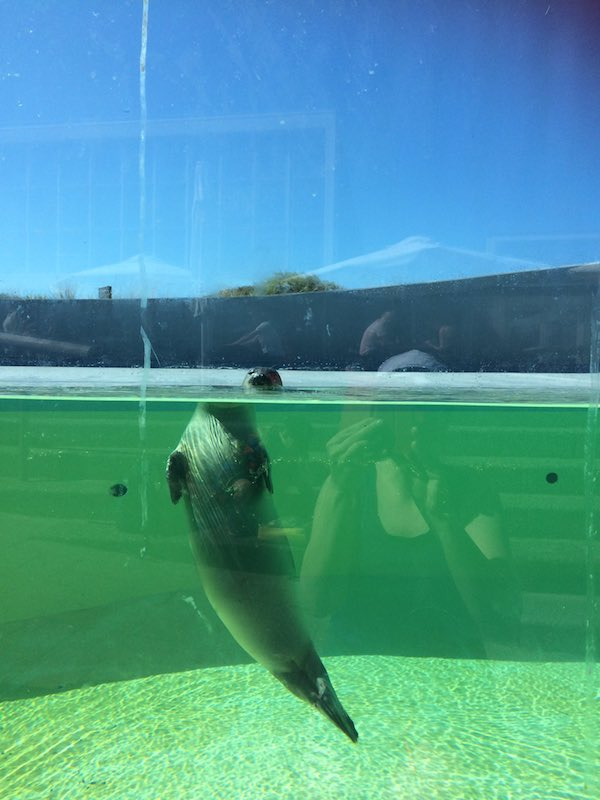
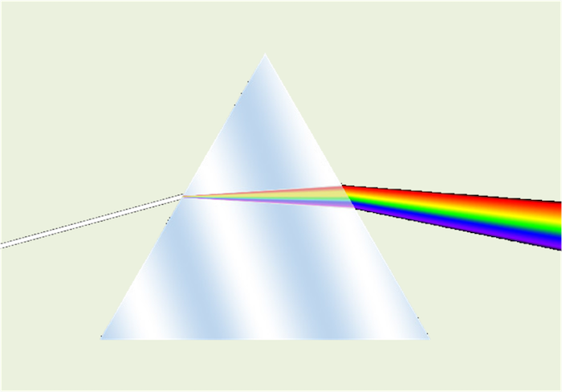

# Eerste uur
Het eerste uur ging over het kijken naar sterren en hoe je dat (het beste) kunt doen. Met het blote oog kun je al veel sterren en sterrenbeelden zien, maar dan moet het wel goed donker zijn. Helaas is het in Nederland op de meeste plekken niet helemaal donker, al zijn er wel plekken (zoals in Drenthe of langs de noordelijke kust) waar het donker genoeg is om toch veel meer sterren te kunnen zien dan in de stad. Maar als je de Melkweg wilt zien (de heldere, witte band langs de hemel) dan moet je echt naar een gebied waar bijna geen lichtvervuiling is, zoals in de bergen.

Om echt goed te kunnen kijken naar sterren en planeten, moet je een sterrenkijker (telescoop) gebruiken (een verrekijker kan ook wel, maar die werkt veel minder goed). Met een sterrenkijker kun je veel meer details zien, zoals de manen van de planeten of de armen van verre sterrenstelsels. Goede sterrenkijkers zijn duur, maar ook met een goedkopere (geen speelgoedding) kan je prima beginnen. Het is ook erg leuk om foto's te maken door een telescoop, omdat je dan vaak nog meer details en vooral meer kleuren kunt zien. Als je zelf geen telescoop hebt, kan je ook naar een sterrenwacht gaan, zoals die in Groningen (http://www.rug.nl/research/kapteyn/sterrenwacht/)

# Tweede uur
In het tweede uur leerden de cursisten hoe licht wordt afgebogen als het door een ander materiaal heen gaat. Zodra een lichtstraal op een voorwerp of een materiaal valt wat doorzichtig is, zal (een deel van) de lichtstraal door het materiaal reizen en er aan de andere kant weer uitkomen. Zoals bij een raam. Maar als de lichtstraal onder een hoek op het object valt, zal de lichtstraal worden afgebogen. Hoe sterk de lichtstraal wordt afgebogen (ofwel: gebroken) hangt af van het soort materiaal. Bij glas zal dit bijvoorbeeld sterker zijn dan bij water. Je zegt dan: glas heeft een hogere brekingsindex dan water. Hoe een lichtstraal precies door een object heen reist, hangt ook af van de vorm van het object. Zo zal een lichtstraal anders door een rechthoek gaan dan door een driehoek. Ook de kleur van het licht bepaalt hoe een lichtstraal precies gebroken wordt: rood wordt minder sterk afgebogen dan blauw. Dit effect zie je bij een regenboog: het zonlicht wordt daarbij gebroken door de regendruppels. Ook met een prisma (een driehoekig stuk glas) kan je een regenboog maken.

*Dit grappige effect wordt veroorzaakt door de breking van het licht door het water*

*De breking van een (witte) lichtstraal door een prisma*
