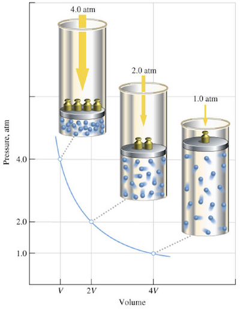

# De wet van Boyle
Overal om ons heen is lucht. Lucht is een gas, en gassen bestaan uit door elkaar heen bewegende en botsende moleculen. Die botsingen van de moleculen zorgen voor een bepaalde druk, in dit geval de luchtdruk. Dat zie je niet en je voelt het meestal ook niet, tenzij de druk snel verandert (zoals wanneer je opstijgt of daalt met een vliegtuig) of als het waait. De druk van een gas kan op verschillende manieren veranderen. Een van die manieren is door in hetzelfde volume (dat is de inhoud van een bepaalde ruimte, zoals een (afgesloten) pot) meer of minder gasmoleculen toe te voegen of weg te halen. Als er minder moleculen zijn, zijn er minder botsingen en dus minder druk. Meer moleculen zorgen juist voor meer botsingen en dus meer druk. In plaats van het aantal gasmoleculen te veranderen, kan je ook het volume van de ruimte veranderen. Als je het volume van een afgesloten ruimte kleiner maakt (en dus geen moleculen toevoegt of weghaalt), zullen de gasmoleculen dichter op elkaar gaan zitten en dus vaker botsen, wat meer druk geeft. Als je het volume weer groter maakt (ook nu zonder het aantal moleculen te veranderen), krijgen de moleculen meer ruimte en zullen ze minder vaak botsen (dus minder druk). Er is een bepaald verband tussen het volume van een gas en de druk van dat gas in een afgesloten ruimte. Dit is de wet van Boyle. Zie de onderstaande afbeelding. De grafiek is geen rechte lijn, maar gekromd. Het komt erop neer dat als je de druk vermenigvuldigt met het volume, er voor elke combinatie steeds hetzelfde getal uit komt; dus: *druk* x *volume* = *constant*

*(De wet van Boyle. Een verkleining van het volume geeft een hogere druk (en andersom).)*

Er werd een experiment gedaan met een afgesloten injectiespuit met daarin een bepaalde hoeveelheid lucht. De spuit werd in een dichte pot gedaan, waarbij de druk in de pot werd verlaagd, waardoor het volume van de lucht in de spuit groter werd. Door het volume van het gas in de spuit af te lezen en de druk in de pot te meten, kon een grafiek worden gemaakt die inderdaad leek op de grafiek hierboven.

Ook de temperatuur van een gas heeft invloed op de druk. Meer warmte zorgt ervoor dat de moleculen sneller gaan bewegen, waardoor de botsingen krachtiger worden en de druk dus groter wordt. Er is geprobeerd om ook dit te meten, maar dat is niet gelukt.

# Uilenballen en beestjes onder de microscoop
De cursisten hebben verschillende dode beestjes (insecten en een spin) onder een microscoop bekeken. Daarna hebben ze uilenballen uitgeplozen om op zoek te gaan naar muizenbotjes. Uilen eten vooral muizen, en de harde resten (botjes en haren) spugen ze uit in de vorm van een harige uilenbal. De botjes konden worden gedetermineerd: door ze te vergelijken met een afbeelding kon bepaald worden om wat voor soort muis het ging, en dus wat de uil precies had gegeten. De botjes konden ook onder een microscoop worden bekeken.
