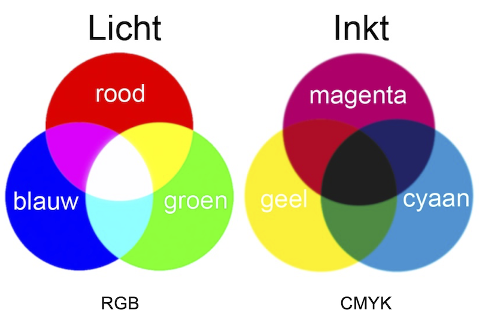
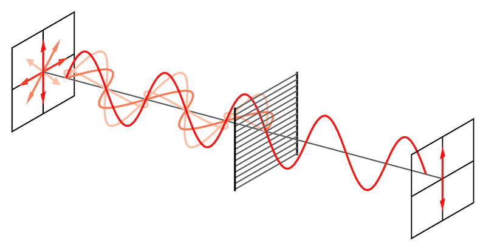

# Licht en kleur
Licht bestaat uit elektromagnetische straling, ofwel elektromagnetische golven. Deze straling is onderdeel van het elektromagnetische spectrum, waaronder ook radiogolven, microgolven, ultraviolet en röntgenstralen vallen. De golven kunnen verschillende golflengtes hebben, dat is de lengte tussen een top en een dal van een golf. Voor licht geldt dat lange golflengtes de kleuren aan de rode kant van het spectrum (de regenboog) vormen, en korte golflengtes de kleuren aan de paarse kant. De kleur van een voorwerp zien we doordat het witte omgevingslicht op het voorwerp valt, en het voorwerp vervolgens alle kleuren absorbeert (opneemt) behalve de kleur die het voorwerp zelf heeft. Deze kleur wordt juist gereflecteerd (weerkaatst) en komt daardoor in onze ogen terecht. Je kunt kleuren op verschillende manieren mengen: door middel van licht (het RGB-model), of door middel van kleurstoffen (het CMYK-model, zoals inkt en verf). Beide manieren zijn eigenlijk elkaars tegenovergestelde (zie onderstaande afbeelding). Niet alle kleuren komen voor in het spectrum. Sommige van die kleuren, zoals magenta, noemen we toch een kleur, maar voor andere 'kleuren', zoals wit en zwart, geldt dat niet altijd.

*(Het RGB- en CMYK-kleurmodel)*

Je taal en cultuur hebben ook invloed op de manier waarop we met kleur omgaan. Er bestaan bijvoorbeeld stammen, zoals de Candoshi in Peru, die geen aparte namen hebben voor kleuren. Ze zien de kleuren wel, maar ze benoemen ze op een andere manier (bijvoorbeeld door ze te vergelijken met kleuren van planten of andere objecten). En we leren hier op school vaak dat de regenboog uit 7 kleuren bestaat, maar in werkelijkheid zijn dat er veel meer (alle kleuren ertussenin). We hebben alleen geen aparte woorden voor al die kleuren. En onze waarneming van kleur laat ons ook nog wel eens in de steek, bijvoorbeeld bij optische illusies.

Niet alle kleuren worden gevormd door kleurstoffen. Er bestaan ook zogeheten structuurkleuren, waarbij de kleuren ontstaan door de structuur van het gekleurde materiaal en de manier waarop het licht zich daarin gedraagt. In de dierenwereld zijn vooral blauw en groen heel vaak structuurkleuren, zoals bij vlindervleugels en vogelveren.

Een andere eigenschap van licht is polarisatie. Dat wil zeggen dat een lichtgolf zich onder verschillende hoeken kan voortbewegen, bijvoorbeeld rechtopstaand of dwars, en alles daartussenin. Er bestaan speciale filters die alleen licht met een specifieke polarisatierichting doorlaten. Door twee van zulke filters over elkaar heen te leggen en rond te draaien terwijl je naar een lichtbron kijkt, kan je het lichter en donkerder maken doordat ofwel veel licht, of juist geen licht wordt doorgelaten. Ook de 3D-brillen in de bioscoop maken gebruik van dit soort filters. Je kunt hier ook bijzondere, kunstzinnige effecten mee bereiken door een stuk doorzichtig plastic te beplakken met stukjes plakband en dit vervolgens voor een gepolariseerde lichtbron (zoals een tv- of computerscherm) te houden en er met bijvoorbeeld een 3D-bril naar te kijken. De cursisten hebben op deze manier zelf mooie kunstwerkjes gemaakt.

*(De polarisatie van licht)*
