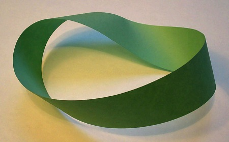

# Wiskundige figuren
De cursisten hebben zelf enkele wiskundige figuren gemaakt van papier. Ze begonnen met een Möbiusband, een bijzondere ronde ring die gemaakt kan worden door van een papieren strook een uiteinde een halve slag te draaien en aan het andere uiteinde te plakken, zodat de bovenkant met de onderkant wordt verbonden. Ze ontdekten dat deze ring geen binnenkant en buitenkant heeft, en ook geen linker- en rechterkant. Dat betekent dat je altijd weer bij je beginpunt uitkomt wanneer je over de ring gaat lopen (of een lijn tekent), en daarbij automatisch beide kanten van de papierstrook passeert. Door de ring in de lengte doormidden te knippen, ontstonden bovendien weer andere ringen, en uiteindelijk zelfs twee losse ringen die in elkaar waren verweven.

*(Een Möbiusband)*

Vervolgens hebben ze ook een zogeheten hexaflexagon gemaakt, een gevouwen vorm die op zo'n manier in elkaar zit dat je door te 'flexen' (het steeds weer op een bepaalde manier binnenstebuiten keren van de vorm) telkens andere patronen krijgt in de tekeningen die je erop maakt. Hoe je zo'n hexaflexagon maakt staat hier uitgelegd: http://slimme-handen.nl/2013/02/hexaflexagons-wiskunde-origami-vouwen/
