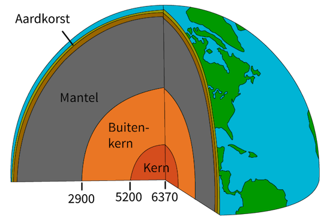
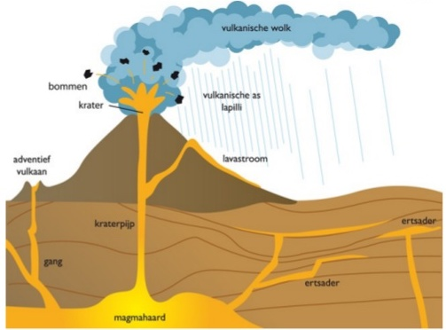

# Vulkanisme
Geologie is de wetenschap die zich bezighoudt met wat er binnenin de aarde gebeurt. Vulkanen liggen vaak aan de oppervlakte van de aarde, maar ze ontstaan door processen die in de aarde plaatsvinden. De aarde is opgebouwd uit een vaste (harde) kern met daaromheen een vloeibaar deel wat bestaat uit gesmolten metaal (ijzer en nikkel). Rondom de kern ligt een dikke mantel van steen, die voor een klein deel vloeibaar is. Het buitenste dunne laagje van de aarde is hard: de aardkorst.

*(De opbouw van de aarde)*

Vulkanen ontstaan door bewegingen van de aardkorst. Omdat de aardkorst als het ware gescheurd is, bestaat hij uit verschillende delen: de aardplaten. Deze aardplaten 'drijven' eigenlijk op de aardmantel. In de gebieden waar de scheuren (breuklijnen) tussen de aardplaten liggen, kunnen aardplaten tegen elkaar botsen of schuiven, of juist van elkaar af bewegen. Door stromingen van gesmolten steen (magma) onder de aardkorst, kan op zulke plekken het magma omhoog komen en door de aardkorst heen naar buiten stromen. Daarbij ontstaat dan een vulkaan. Wanneer magma vanuit de aarde aan de oppervlakte komt, wordt het lava genoemd. Hoge vulkanen (stratovulkanen) ontstaan waneer er dik en stoperig magma omhoog komt waarbij er veel druk ontstaat in de aarde. Uitbarstingen van zulke vulkanen zijn vaak explosief. Lagere vulkanen (schildvulkanen) ontstaan wanneer het magma wat naar boven komt erg dun en vloeibaar is en zich makkelijk over de omgeving verspreidt.

*(De opbouw van een (strato)vulkaan)*

Wanneer lava afkoelt, wordt het weer hard. Er ontstaat dan een vulkanisch gesteente. Het soort gesteente wat ontstaat hangt onder andere af van de samenstelling van de lava en de manier waarop het aan de oppervlakte is gekomen en afkoelt. Bekende soorten vulkanisch gesteente zijn obsidiaan (vulkanisch glas), puimsteen (heel licht en poreus (met veel gaten)) en basalt (wordt gebruikt bij het verstevigen van dijken).
