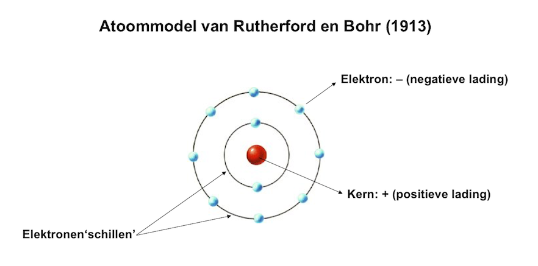
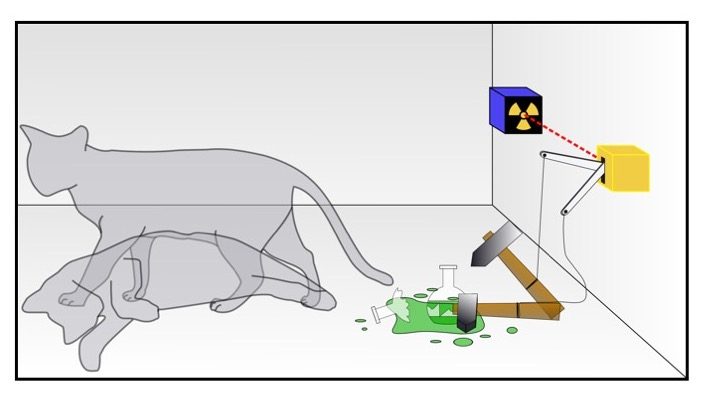

# Quantummechanica en vuurwerk
Mechanica gaat over de beweging van voorwerpen. De klassieke mechanica gaat over de beweging van grotere (zichtbare) voorwerpen, terwijl de quantummechanica gaat over het gedrag en de beweging van de allerkleinste (onzichtbare) deeltjes. Vallende appels en kaatsende biljartballen zijn meestal nog wel te begrijpen, omdat we gewend zijn hoe die voorwerpen bewegen. Maar de kleinste deeltjes waaruit alles om ons heen bestaat, doen dingen die we ons niet voor kunnen stellen. Omdat we ze niet kunnen zien en alleen maar kunnen meten en berekenen hoe die deeltjes zich gedragen, kunnen we alleen maar aannemen dat het nu eenmaal zo werkt in de natuurkunde.

Alle materie om ons heen (jijzelf, de tafel, de lucht) bestaan uit moleculen. Maar die moleculen bestaan ook weer ergens uit, namelijk uit atomen. En zelfs die atomen zijn weer opgebouwd uit andere deeltjes. Een eenvoudig waterstofatoom bestaat uit een kern met daaromheen een elektron, wat rondjes draait in een baan om de kern. Als een soort mini-zonnestelsel, met de zon in het midden (de kern) en een elektron als planeet. Dit simpele model van een atoom klopt echter niet. In werkelijkheid draaien de elektronen in vreemd gevormde banen om de kern heen en bevat elke baan maximaal 2 elektronen.

*Het eenvoudige atoommodel, wat in werkelijkheid niet helemaal klopt*

Elektronen zijn kleine deeltjes, en ze zijn onderdeel van een veel grotere 'familie' van deeltjes waaruit het hele universum is opgebouwd. Het bijzondere van deze allerkleinste deeltjes is dat ze zich niet alleen als deeltje (dus als iets tastbaars), maar ook als golf kunnen gedragen (iets ontastbaars). Een elektron golft dus eigenlijk om de kern heen, als een staande golf (een golf die op zijn plek blijft en zich dus niet verplaatst). Daarbij is het elektron eigenlijk op elke plek tegelijkertijd, totdat je gaat meten ('kijken') waar hij precies is.

Omdat elektronen zowel een deeltje als een golf zijn, kun je er ook experimenten mee doen die lijken op experimenten die je met licht (ook een golf) kunt doen. Het soort experiment wat je doet bepaalt of een elektron zich als deeltje of als golf gedraagt.

Een bekend gedachtenexperiment (een experiment wat je alleen in je hoofd uitvoert) over quantummechanica is van de natuurkundige Erwin Schrödinger. Hij bedacht het volgende. Wanneer je een kat in een afgesloten doos stopt met daarbij een radio-actief deeltje, wat als het uit elkaar valt een mechananisme activeert wat ervoor zorgt dat een flesje gif kapot gaat, je zonder te kijken niet weet of de kat levend of dood is. Wanneer het radio-actieve deeltje uit elkaar valt, sterft de kat. Maar als dat niet gebeurt, blijft de kat leven. Er is een kans dat het radio-actieve deeltje binnen een uur uit elkaar valt, maar het is niet zeker dat dat gebeurt. Je weet pas of dat gebeurd is als je gaat kijken in de doos. Als de kat dan levend is, is het deeltje niet uit elkaar gevallen. Als de kat dood is wel. Maar zo lang je dat niet weet, zou je kunnen zeggen dat de kat zowel dood als levend is op hetzelfde moment. De kat verkeert dus in twee toestanden tegelijkertijd. Natuurlijk kan een kat niet echt tegelijk dood als levend zijn, daarvoor is hij te groot. Maar bij de kleinste deeltjes kan dus dus wel het geval zijn: ze kunnen in twee toestanden tegelijk verkeren (bijvoorbeeld zowel de ene als de andere kant opdraaien, alsof een tol zowel links- als rechtsom draait). Dat dit echt zo is kunnen wij ons niet voorstellen, we kunnen het alleen maar aannemen.

*De kat van Schrödinger*

Enkele toepassingen van de quantummechanica zijn te vinden in elektronica, maar ook in bijvoorbeeld elektronenmicroscopen en MRI-scanners. Daarnaast is men hard bezig met het ontwikkelen van een quantumcomputer, die vele malen sneller kan rekenen dan de huidige computers. Maar ook vuurwerk heeft veel te maken met quantummechanica. Dat komt doordat de kleuren van vuurwerk worden veroorzaakt door een quantummechanisch verschijnsel. Dat heeft te maken met de banen waarin de elektronen rond de kern van een atoom bewegen. Een elektron in een baan rond de kern van het ene atoom heeft een net iets andere energie dan een elektron in dezelfde baan in een ander atoom. Wanneer je de atomen bijvoorbeeld verhit, gaan de elektronen naar een hogere baan (verder van de kern). Hierna vallen de elektronen uit zichzelf weer terug naar hun oorspronkelijke baan, waarbij ze licht uitzenden van een specifieke kleur. Elke atoomsoort zendt daarbij een andere kleur uit. Door bepaalde atoomsoorten aan vuurwerk toe te voegen, kan je dus gekleurd vuurwerk maken. Zo geeft koper een blauwe kleur, barium een groene kleur en natrium een gele kleur.

De cursisten hebben zelf ook een soort vuurwerk gemaakt door de stoffen kaliumnitraat (een soort kunstmest) en suiker met elkaar te mengen en aan te steken. Dit gaf een fonteinachtig effect met veel rook.
