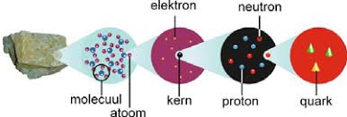
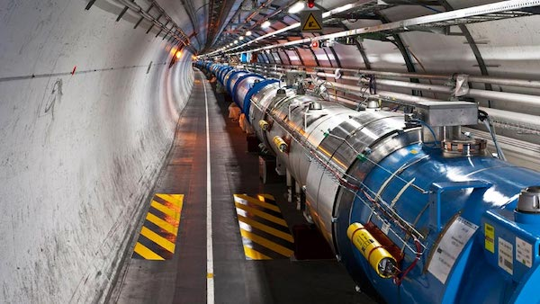

# Het CERN en de kleinste deeltjes
Alles om ons heen bestaat uit materie, zoals water, lucht, metaal en steen. Deze materie bestaat uit moleculen, de kleinste 'stukjes' die nog de eigenschappen hebben van het materiaal. Bijvoorbeeld een watermolecuul. Moleculen zijn al zo klein dat ze niet meer met een gewone microscoop te zien zijn. Maar ook moleculen bestaan weer uit nog kleinere stukjes: atomen. Een watermolecuul bestaat bijvoorbeeld uit twee waterstofatomen en een zuurstofatoom (H2O). Daar blijft het niet bij, want ook atomen zijn weer opgebouwd uit andere deeltjes, namelijk elektronen, protonen en neutronen. En zelfs de protonen en de neutronen bestaan weer uit andere deeltjes: quarks. Elektronen en quarks zijn niet verder op te delen: het zijn zogeheten elementaire deeltjes. Je kunt ze zien als de Legosteentjes waarmee alles om ons heen te bouwen is. Daarnaast bestaan er nog andere elementaire deeltjes, zoals lichtdeeltjes (fotonen) en neutrino's (deeltjes die overal dwars doorheen gaan).

Om onderzoek te kunnen doen aan deze onvoorstelbaar kleine deeltjes, heb je niets aan een microscoop. Je kunt ze dus niet zien, maar je kunt er wel allerlei metingen en experimenten mee doen. Hiervoor maken onderzoekers gebruik van deeltjesversnellers, zoals die van het CERN in Zwitserland. Dit is een enorm apparaat waarin deeltjes, zoals protonen, worden versneld met hele sterke magneten. Hiervoor zijn kilometers lange buizen nodig, die in een grote cirkel onder de grond liggen. De deeltjes worden daarin zo sterk versneld dat ze bijna met de lichtsnelheid (300.000 km/seconde) door de buis vliegen. Door de deeltjes in de buis met deze snelheid op elkaar te laten botsen, ontstaan er andere deeltjes uit de brokstukken. Met speciale detectoren kunnen deze deeltjes gemeten worden. Soms ontdekt men zo een nieuw deeltje, zoals het Higgsdeeltje.

*(Een klein stukje van de ondergrondse versnellerbuis van het CERN)*

