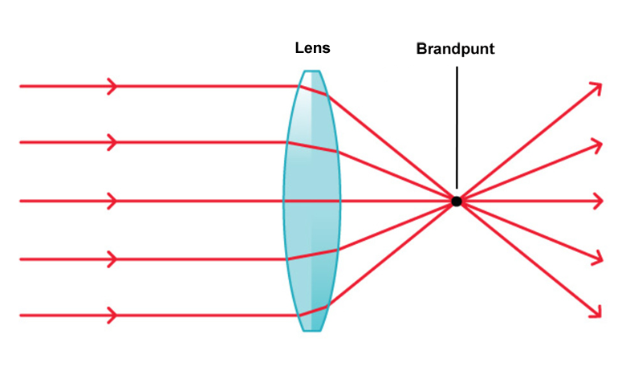

# Optica: lichtbreking
Tijdens deze les hebben de cursisten zelf lenzen gemaakt door potjes te vullen met water. Ze hebben geleerd dat als een lichtstraal (een laserpointer in dit geval) door het midden van zo'n potje gaat, hij rechtdoor gaat. Maar wanneer ze de lichtstraal een stukje opzij van het midden richtten, kwam de lichtstraal er onder een andere hoek weer uit. Hij werd dus afgebogen door het potje (de lens). Door de lichtstralen die je op het potje richt te volgen en op een vel papier te tekenen, kan je zien dat de lichtstralen elkaar aan de andere kant van het potje steeds snijden in een bepaald punt: het brandpunt. In dat punt komen alle lichtstralen dus samen. Je kent dat misschien wel van het spelen met een vergrootglas in de zon: door het vergrootglas op de zon te richten en te zorgen dat je met de lichtstralen een klein puntje maakt op bijvoorbeeld een stukje papier, wordt dat lichtpuntje zo heet dat het papier in brand vliegt. Dat lichtpuntje is het brandpunt. Elke lens heeft zijn eigen brandpunt. Bij een grote lens ligt dit brandpunt verder van de lens af dan bij een kleine, bollere lens. Een kleine, bolle lens vergroot dan ook sterker dan een grotere. Dat zie je bijvoorbeeld bij een microscoop: deze kan zo sterk vergroten doordat de lensjes in de microscoop ontzettend klein zijn.

Licht kan niet alleen afgebogen worden door een materiaal (zoals een lens), maar kan er ook in 'gevangen' worden. Als een lichtstraal vanaf de bovenkant in een met water gevulde cilinder valt en je richt de straal tegen de binnenzijde van de cilinder, dan kaatst de lichtstraal terug de cilinder in en komt dus niet naar buiten. Dit is het principe van een glasvezelkabel. Met een glasvezelkabel kunnen lichtstralen worden getransporteerd over grote afstanden, zonder dat het licht de kabel verlaat. Zelfs niet als je allerlei bochten in de kabel maakt. Het licht zit opgesloten omdat het steeds tegen de binnenkant van de kabel weerkaatst wordt.

*(Licht wat door een aantal glasvezelkabeltjes gaat)*
