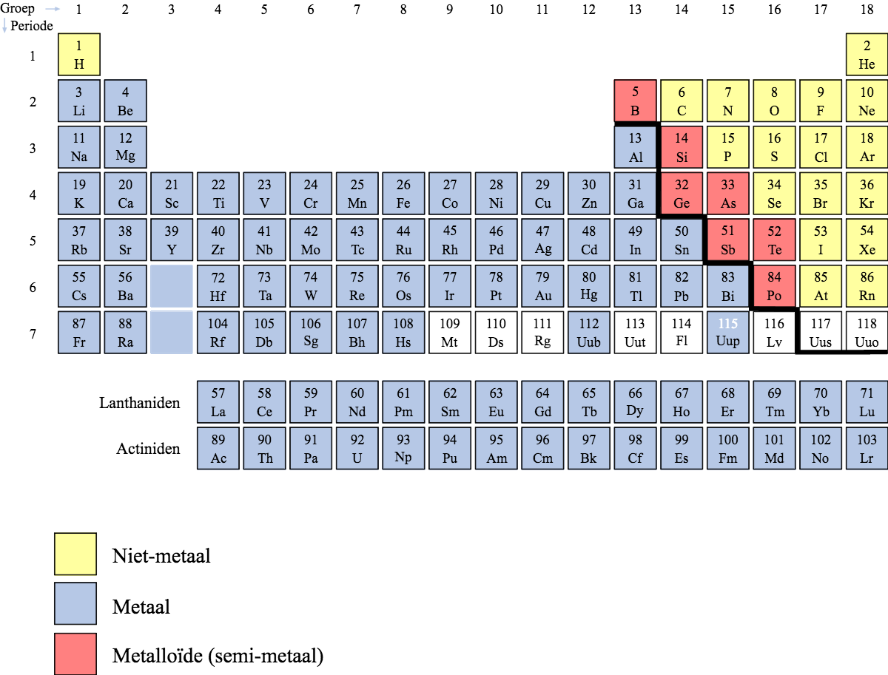
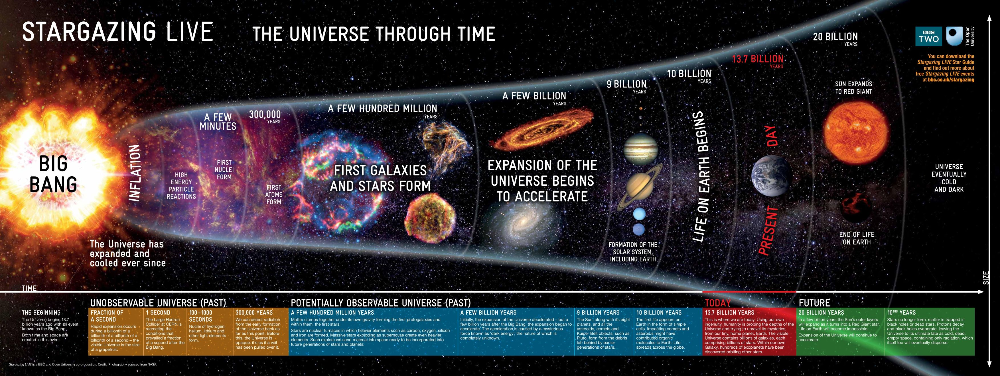
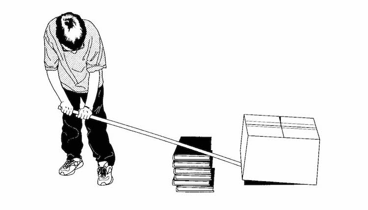

# Eerste uur
In het eerste uur werd uitgelegd wat moleculen, atomen en elementen zijn. Moleculen zijn de kleinste deeltjes waaruit een bepaalde stof bestaat. Zo bestaat water uit watermoleculen en alcohol uit alcoholmoleculen. Maar moleculen zelf zijn ook weer opgebouwd uit andere onderdelen, namelijk atomen. Er bestaan veel soorten atomen, en elke atoomsoort heeft weer andere eigenschappen. Net zoals er verschillende soorten Legoblokjes bestaan die verschillende eigenschappen hebben (denk aan grootte, kleur, vorm, aantal nopjes). De verschillende atoomsoorten worden elementen genoemd. Moleculen bestaan meestal uit verschillende elementen. Water bestaat bijvoorbeeld uit twee waterstofatomen en een zuurstofatoom (scheikundig schrijf je dat als H2O: H is waterstof, O is zuurstof). Alle bestaande elementen staan gerangschikt in het zogeheten Periodiek Systeem der Elementen, bedacht door de Rus Dmitri Mendelejev in 1869. Hierin staan de elementen gesorteerd van klein naar groot (ofwel van licht naar zwaar), en op zo'n manier dat de elementen met ongeveer dezelfde eigenschappen onder elkaar staan. Verder worden elementen opgedeeld in metalen, niet-metalen en een soort tussenvorm: de metalloïden of semi-metalen.

*Het periodiek systeem*

De meeste elementen zijn ontstaan in sterren, door kernfusie. Vlak na de oerknal was er bijna alleen waterstof, maar toen de eerste sterren ontstonden (na een paar honderd miljoen jaar) werd waterstof omgezet in helium en daarna, door zwaardere sterren, in zwaardere elementen. Omdat wij voor een belangrijk deel uit zwaardere elementen bestaan, zoals zuurstof en koolstof, kun je dus zeggen dat wij uit sterrenstof bestaan. De elementen die ons lichaam vormen zijn immers ooit in sterren gevormd, en toen deze sterren aan het eind van hun leven ontploften en al hun gassen het heelal in bliezen, konden hieruit weer nieuwe sterren en planeten zoals de Aarde onmtstaan.

*De tijdlijn van de vorming van het heelal. Het element waterstof is vlak na de oerknal (Big Bang) gevormd, de meeste andere elementen pas na het ontstaan van de eerste sterren.*

Link naar een filmpje over het Periodiek Systeem: http://ntracademie.nl/clips/clip/show/188-periodiek-systeem.html

# Tweede uur
Dit uur ging over krachten, katrollen en hefbomen. De cursisten hebben zelf met katrollen geprobeerd om allerlei gewichten op te tillen om zo te ervaren dat dat makkelijker gaat dan zonder katrollen. Dat komt doordat het gewicht door de katrollen verdeeld wordt over meerdere kabels. Hoe meer kabels (en dus hoe meer katrollen) je gebruikt, hoe lichter het wordt om iets op te tillen. Het is alleen wel zo dat hoe meer katrollen je gebruikt, hoe langzamer je het gewicht omhoog trekt. Het kost je dus minder kracht, maar je moet wel vaker trekken waardoor het langer duurt. Op deze manier kan je zelfs hele zware voorwerpen, zoals een auto, in je eentje omhoog hijsen. Als je maar genoeg katrollen en genoeg touw gebruikt. Hijskranen werken ook volgens dit principe.

Hefbomen verdelen ook de kracht, maar dan door hun lengte. Hoe langer de hefboom, hoe meer kracht je kunt zetten. Denk maar aan een notenkraker of nijptang: hoe langer het handvat hiervan, hoe groter de kracht op de noot of de spijker. In theorie zou je zelfs de Aarde in je eentje kunnen optillen, als je hefboom maar lang (en stevig) genoeg is. Op een wipwap kun je ervaren wat er gebeurt als je dichter naar het midden of juist verder van het midden gaat zitten.

*Een hefboom*
